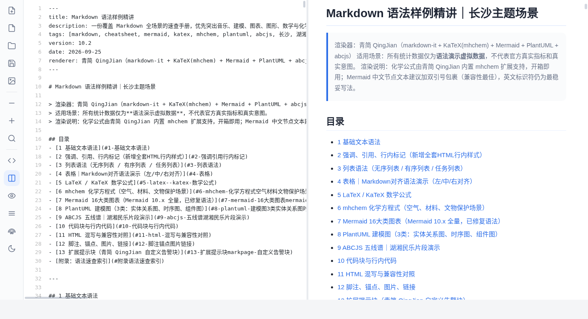
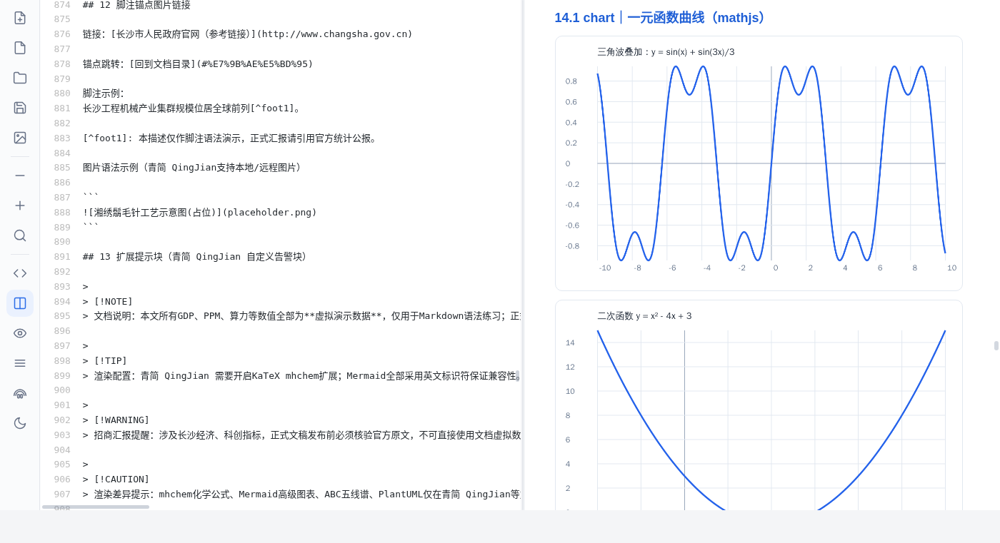
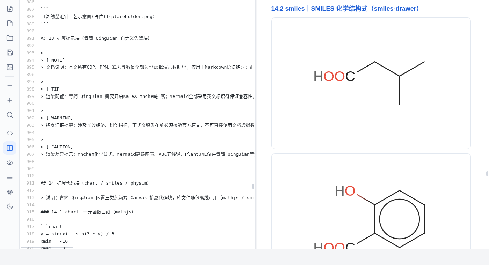
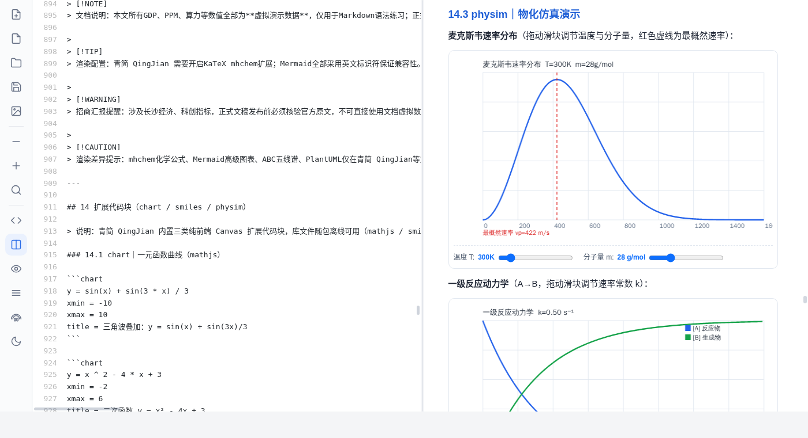
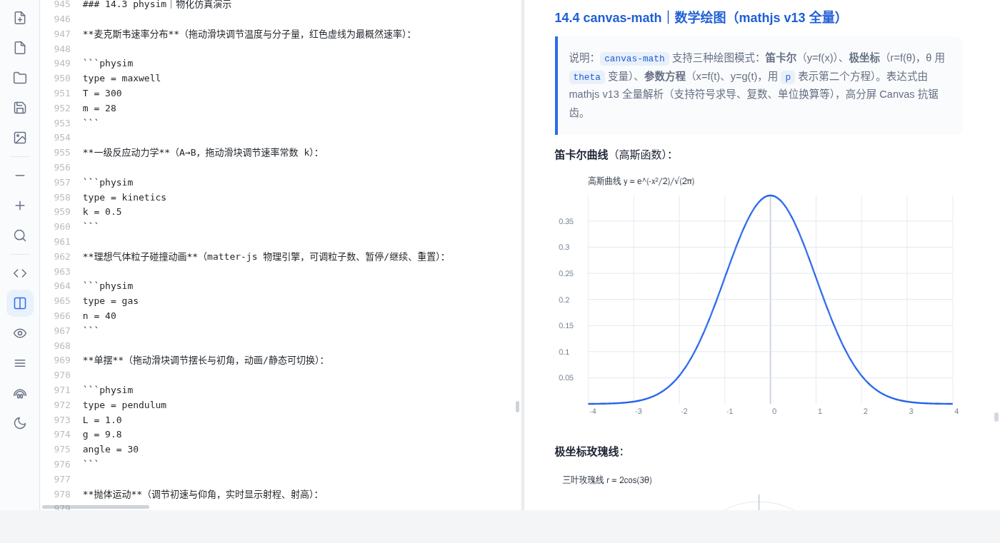
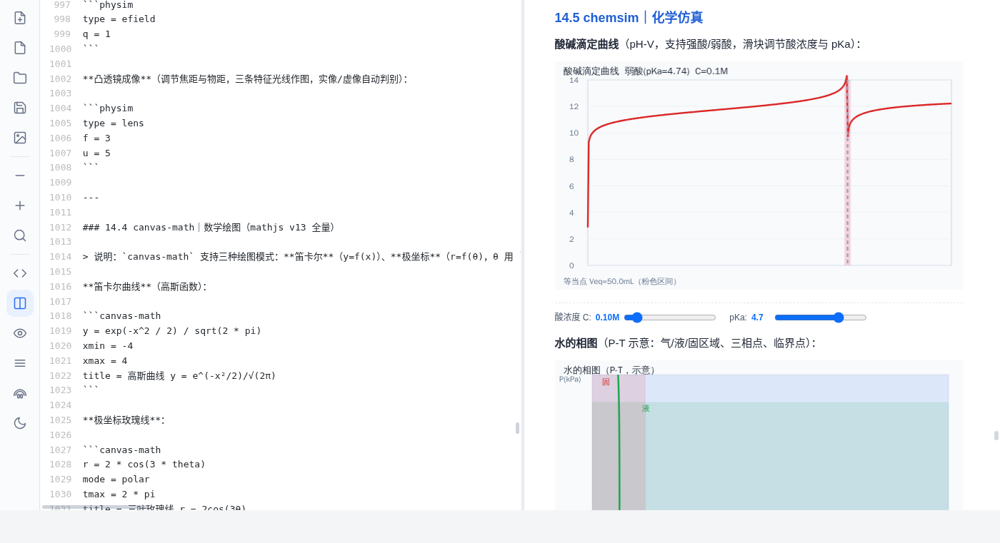
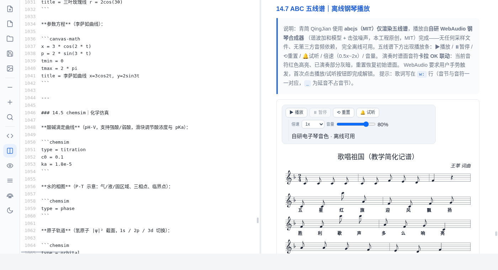
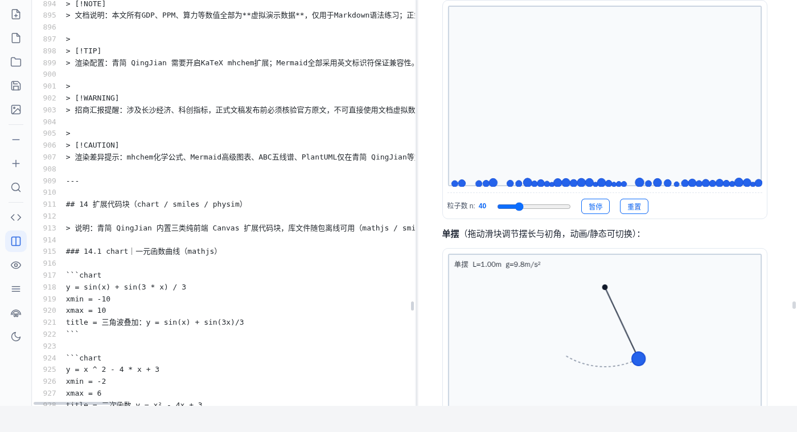

> 以简驭繁 · 落笔成章 —— 浏览器原生离线创作环境，支持 Markdown 语法
**The Lightweight Markdown Studio** · 纯前端 · 免安装 · 无网络依赖 · 全部离线可用

青简是开箱即用的离线创作工作台：下载一个 HTML 文件，双击即可开展教学演示、知识笔记与习题推演。它兼容主流 Markdown 扩展语法，内置 LaTeX 数学公式、Mermaid 全类型图表、五线谱、化学结构式、物理/化学/天文仿真、朗读电子书、网络电台等能力。所有资源随包离线加载，不需要联网、不需要注册、不需要安装任何软件。

## 特性速览

| 领域 | 能力 |
| --- | --- |
| 写作 | 基础语法 / 表格 / 脚注 / 任务列表 / 定义列表 / GitHub 提示块 / 折叠 / Emoji / 转义 |
| 数学 | 行内与块级 KaTeX 公式、`mhchem` 化学方程式、矩阵 / 分段函数 / 对齐环境 |
| 图表 | Mermaid 全 24 种图表（流程图 / 时序 / 类图 / 状态 / 甘特 / 饼图 / 思维导图 / ER / 旅程 / Git / 时间线 / 四象限 / 桑基…） |
| 建模 | PlantUML 时序 / 用例 / 类图（本地降级渲染，离线可用） |
| 乐谱 | ABC 五线谱 + 自研 WebAudio 钢琴合成（播放 / 暂停 / 重置 / 倍速 / 音量，卡拉 OK 式音符高亮） |
| 扩展代码块 | `chart` 一元函数曲线 · `canvas-math` 数学绘图 · `smiles` 化学结构式 · `physim` / `chemsim` / `astrosim` 交互式仿真（滑块 / 动画 / 暂停重置） |
| 电子书 | 打开 `.epub`（章节目录 + 图片内联 + 默认整页预览）、`.html` / `.txt` / `.doc`(只读提示另存) |
| 朗读 | 句子级分句朗读、卡拉 OK 跟读高亮、语速 / 语言 / 音源可调（系统 TTS / 本地音库 / Edge 在线 / Azure） |
| 电台 | `radio` 代码块 + 本地频道管理器（m3u8 / mp3 / aac 流，localStorage 保存，支持 .m3u 批量导入） |
| 工程 | 双栏编辑预览、目录 / 文件树、源码区行号 + 代码高亮 + 自动补全、多标签页、最近打开、PDF / HTML / Word 导出、图片 / 音视频插入、上传 / 打开文件夹 |
| 平台 | PC / 安卓自适应（横竖屏、等比缩放）、单文件 / 分置 / 模块三种交付形态 |

## 快速开始

```bash
# 方式一：单文件版（推荐体验）
# 打开 dist/QingJian-standalone.html 即可使用（约 12MB，所有资源内嵌）

# 方式二：分置版
# 打开 dist-split/QingJian-split.html（约 5MB，依赖同目录 assets/）

# 方式三：模块化项目（开发 / 二次开发）
# 解压 QingJian-v14.21-modular.zip，目录结构见 docs/ARCHITECTURE.md
```

> 提示：`file://` 协议下即可运行，无需本地服务器；若使用"打开文件夹 / 导出"等文件系统能力，建议在现代浏览器（Chrome / Edge）中打开以获得最完整体验。

## 截图

















## 文档

- [能力清单 CAPABILITIES.md](docs/CAPABILITIES.md)
- [架构与渲染管线 ARCHITECTURE.md](docs/ARCHITECTURE.md)
- [合规与依赖说明 COMPLIANCE.md](docs/COMPLIANCE.md)
- [快速开始与常见问题 QUICK-START.md](docs/QUICK-START.md)

## 依赖许可

青简使用纯 MIT / Apache-2.0 / BSD 许可的开源库，无 GPL、无 CC-BY、无需要商用授权的字体或音色。完整清单见 [COMPLIANCE.md](docs/COMPLIANCE.md) 与随包 `NOTICE.md`。

## 许可

[MIT License](LICENSE)

Copyright (c) 2026 QingJian Contributors
